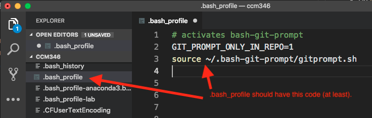

# Setting up your Macintosh, Part 1

Everything listed here is free unless otherwise noted.

## At the beginning of the semester

### Code editor

* Install the code editor [Visual Studio Code](https://code.visualstudio.com/download). There are other good ones ([Atom](https://atom.io/), [Sublime](https://www.sublimetext.com/3)), but I'll use VS Code in class.
* Add the `code` command [to your path](https://code.visualstudio.com/docs/setup/mac).

### Version control system

* Install [Git](https://git-scm.com/downloads), our source code version control program. This will allow us to save our code in steps. Don't worry about the Git GUI clients.
* [Set your user.name and user.email](https://help.github.com/articles/setting-your-username-in-git/) in Git.

### Set up Github

If you don't already have a Github account, go to [github.com/](http://github.com/) and create an account. Two important things to note:

* Choose your username carefully. I wouldn't use upper case characters or special characters because this will become part of a URL later. Don't make the name specific to this class. This is your personal Github profile FOREVER.
* USE YOUR UNIVERSITY EMAIL IF YOU HAVE ONE. You might want to apply for the [Student developer pack](https://help.github.com/articles/applying-for-a-student-developer-pack/), which will get you private repositories.

### Saving your Github credentials

There are ways you can tell your computers to save your Github username/password. If you are using your own machine, I suggest this first one, setting up SSH keys. If that proves difficult, try the second option.

- I use these directions to create [SSH keys](https://help.github.com/articles/connecting-to-github-with-ssh/) on my machine so I'm never asked for a password. It is not as scary as it looks, though there is some command-line foo to execute.
  - During this process, you'll be asked to save the location of the rsa_id. Just hit return to save the default location.
  - You'll be asked to set a password for the file. Just leave this blank and hit return. It may ask you a couple of times.
  - At the end of the installation, it will give a path to the rsa_id file. We might need to open this file in the next step to copy it. Ask for help at this step.

### Add the SSH key to Github

- Follow [these directions](https://help.github.com/articles/adding-a-new-ssh-key-to-your-github-account/) to add your key to Github.

### Alternative to SSH keys

(If you can't set up SSH, you can reduce the number of times you have to enter your Github name/password by [caching your password](https://help.github.com/articles/caching-your-github-password-in-git/). We'll have to use this method for lab computers.)

### Installing bash-git-prompt

- Open a new Terminal window and do the following, one line at at time:

```bash
$ cd ~
$ git clone https://github.com/magicmonty/bash-git-prompt.git .bash-git-prompt --depth=1
$ code .bash_profile
```

- This should install the software you need to your home directory, then open (or create) the `.bash_profile` file.
- Add this to the bottom of the file `.bash_profile` file:

``` text
GIT_PROMPT_ONLY_IN_REPO=1
source ~/.bash-git-prompt/gitprompt.sh
```

- Close and restart your terminal to take the new settings.

[More on git-bash-prompt if we need it](https://github.com/magicmonty/bash-git-prompt).

## Testing Part 1

We need to make sure everything is set correctly before moving on. So here is how to check:

Before doing this, open a new Terminal window:

- Do `cd ~` to make sure you are in your home directory.
- Do `git config user.name` and you should get a response that is your name.
- Do `git config user.email` and you should get back your email address.
- Do `ssh -T git@github.com` to test SSH keys. If you are asked about "RSA key fingerprint", say yes. In the end, you should have a success message like: "Hi username! You've successfully authenticated, but GitHub does not
provide shell access."
- Do `code ./` and it should launch VS Code in your home directory.

In the list of Documents, there should be two things:

1. A folder called `bash-git-promopt`.


2. A file called `.bash_profile` with the bash-git-prompt info:


