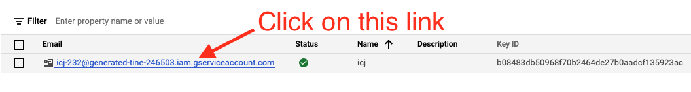
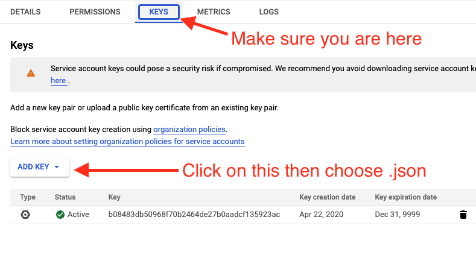

# Old Google auth for Windows

> This is older documentation for a authentication method that is deprecated by Google. They recommend against building keys like this, which is why we use the gcloud CLI now. I'm keeping this for posterity since we are having trouble installing gcloud cli on a Windows machine.

## Google Drive authentication

There is a point in class when your computer will need access to your Google Drive account. Much like we did with ssh keys, we'll create a file to save on your computer that includes a secret key that works only for you.

### Creating a service account

**Make sure you're logged into a _personal_ gmail account for this part**. If you use your utexas.edu email, you won't have permission to do what we need to do.

The instructions for how to create a service account on Google are [here](https://cloud.google.com/docs/authentication/getting-started). Follow that link and click on `Go to the Service Account Key page`.

- First, you must create a project. The term "project" is a little misleading because you do not need to do this for each project. You only need to do this once per email address. Name your project `icj-project`.
- You are next directed to create a "service account key".
  - For **Service account**, choose "New service account".
  - For the **Service account name**, use `icj`. The **Service account ID** will get filled out for you.
  - For Role, use the **Select a role** dropdown and go to `Project --> Owner` and select it.
- At this point you should be taken to a page that shows your "Service Accounts". There is a row that shows something like this:



- Click on the link noted above
- You'll be taken to a Service Account Details page, where there are some tabs. Click on the one called **Keys**.



- Use the **ADD KEY** button then **Create new key** option, choose the **JSON** option and click **CREATE**.
- A file will be saved on your machine. _This file is important_ and you need to keep it on your machine! I renamed my file `google_drive_fetch_token.json` and put it in same folder with all of my other icj class projects, for example: `/c/Users/christian/Documents/icj/google_drive_fetch_token.json`.
- Next go the [API Library page](https://console.cloud.google.com/apis/library).
- Use the search to find the **Google Docs API** and select it.
  - Make sure `icj-project` is selected in the top nav near the Google Cloud Services logo.
  - Then click on the **Enable** buttton to activate it.
- Use the search bar to find **Google Sheets API** and choose it and **Enable** it.

### Setting up the environment variable

> There _may_ be some issues setting this up on Windows machines that use OneDrive. It has been successfully installed on a non-OneDrive setup using this method.

We are setting this environment variable to authenticate ourselves to Google using the information in the json file you just created.

- Open a new Git Bash prompt
- Do `code .bash_profile` to open your ".bash_profile" file in VS Code. You should see some stuff there already from other configurations. (Hollar if you don't as that means you are likely in the wrong file.)
- Add the text below to this file, but **with your home directory name as `your_username`**.

```bash
# Google Auth
export GOOGLE_APPLICATION_CREDENTIALS="C:/Users/your_username/Documents/icj/google_drive_fetch_token.json"
```

If you have and use Microsoft OneDrive, then you might need to modify that path just a bit:

```bash
# Google Auth
set GOOGLE_APPLICATION_CREDENTIALS="C:/Users/your_username/OneDrive/Documents/icj/google_drive_fetch_token.json"
```

We'll test this with the icj-project-template when the time comes. If you use OneDrive, you might have to use **Git Bash** for some steps instead of the terminal within VS Code.

### Possible test scenario

- Create a folder in your icj folder called `yourname-test`.
- Open that folder in Visual Studio Code.
- Open a VS Code Terminal and run:

```bash
$ degit utdata/icj-google-fetch-test#main
```

You should get this in return:

```bash
> cloned utdata/icj-google-fetch-test#main
```

And it will download a bunch of files into your folder.

- Run `npm install`. This will also download a bunch of files. It might take a couple of minutes to run.
- Run `gulp fetch`.

If everything works, you should have a return like this:

```bash
$ gulp fetch
[14:38:53] Using gulpfile ~/Documents/icj/icj-fetch-test/gulpfile.js
[14:38:53] Starting 'fetch'...
[14:38:53] Finished 'fetch' after 8.61 ms
Downloaded `library` (1RgMhjtkXlbbf9uzSzy_xPRKwxcVZIZqVytgM_JoU4E4)
Downloaded `bookstores` (1gDwO-32cgpBDn_0niV0iu6TqQTaRDr4nmSqnT53magY)
```

Your path might differ for "Using gulpfile", but what you are looking for is **"Downloaded \`library\`"** and **"Downloaded \`bookstores\`**. If you didn't get BOTH of those then something isn't right.

If you get an error, try this before reaching out to me:

- Open Git Bash
- Use `cd` to get into your test folder. Make sure you are there using `pwd`.
- run `gulp fetch` to see if it downloads two files.

If that also doesn't work, reach out to me to troubleshoot.

----

> Note for Crit: Might be able to use `%userprofile%` instead of `C:/Users/your_username/`.
