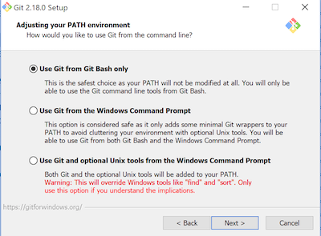

# Windows

I am a little less familiar with Windows, especially as it relates to OneDrive, so it's possible we'll run into issues. We'll solve them.

Everything listed here is free.

## Install git

> Windows users have to install Git and Git Bash before doing the [Command-line interface tools lesson](https://github.com/utdata/icj-cli-tools). These next few steps do that.

- Install [Git](https://git-scm.com/downloads), our source code version control program. This will allow us to save our code in steps. This will also install **Git Bash**, which will be your Terminal app.

There is one point in the installation process where you need to set "Use Git from Git Bash only".



- Use the default settings for everything else.
- You should now be able to find **Git Bash** from your Windows Start menu.

> If you were sent here from the Command-line interface tools lesson, it's time to [go back there now](https://github.com/utdata/icj-cli-tools#using-bash-and-a-terminal). You'll be sent back here to finish the rest later.

### Set up your git user and email

Next we'll set [set your user.name](https://help.github.com/en/github/using-git/setting-your-username-in-git#setting-your-git-username-for-every-repository-on-your-computer) so Git knows who you are.

- In your Git Bash program, do this but use _your_ name instead of Mona Lisa:

```bash
$ git config --global user.name "Mona Lisa"
```

Now we'll [set your user.email](https://help.github.com/en/github/setting-up-and-managing-your-github-user-account/setting-your-commit-email-address#setting-your-commit-email-address-in-git).

- In Git Bash do this but use your email:

```bash
$ git config --global user.email "email@example.com"
```

You will want to use the same email to create your Github account next.

### Set up Github

If you don't already have a Github account, go to [github.com/](http://github.com/) and create an account.

- Choose your username carefully. Avoid using upper case characters or special characters because this will become part of a URL later. Don't make the name specific to this class. This is your personal Github profile FOREVER.

### Saving your Github credentials

There are ways you can tell your computers to save your Github username/password. If you are using your own machine, I suggest this first one, setting up SSH keys. If that proves difficult, try the second option.

I use [these directions to create SSH keys](https://docs.github.com/en/free-pro-team@latest/github/authenticating-to-github/generating-a-new-ssh-key-and-adding-it-to-the-ssh-agent) on my machine so I'm never asked for a password. But heed this advice:

- During this process, you'll be asked to save the location of the rsa_id. **Just hit return to save the default location.**
- You'll also be asked to set a password for the file. **JUST LEAVE THE PASSWORD BLANK** and hit return. It will ask you a couple of times.
- At the end of the installation, it will give a path to the rsa_id file. We might need to open this file in the next step to copy it. Ask for help at this step.

The last step of this links you to adding your SSH key to github.

### Add the SSH key to Github

- Follow [these directions](https://help.github.com/articles/adding-a-new-ssh-key-to-your-github-account/). They explain it pretty well. Make sure you are on the Windows version.

### Alternative to SSH keys

If you can't set SSH keys, you can at least reduce the number of times you have to enter your Github name/password by [caching your password](https://help.github.com/articles/caching-your-github-password-in-git/). We'll have to use this method for lab computers.

## Text editor

We will use the code editor Visual Studio Code, made by Microsoft. It is free. We need to install it now.

- Install [Visual Studio Code](https://code.visualstudio.com/docs/setup/windows).
- After installing, we need to configure your VS Code integrated terminal to use Git Bash. Go to View > Command Palette and type in `>Terminal: Select Default Shell` and choose it. When it prompts you with choices, choose **git bash**.
- Open your Command Palette again (Cmd+Shift+p or View > Command Palette) and type in `>shell command` and look for the return **Shell Command: Install 'code' command in PATH. Choose that.


- Quit both VS Code and Git Bash for this to take affect.

## Installing bash-git-prompt

- Open a **new** Git Bash window to install the `git-bash-prompt` and do the following:

```bash
git clone https://github.com/magicmonty/bash-git-prompt.git .bash-git-prompt --depth=1
```

This should install the software you need to your home directory.

Now we need to create your bash profile.

- Do `code .bash_profile` to open or create your `.bash_profile` file.
  - Hollar at me if this doesn't open VS Code and create the file.
- Add this to the bottom of the file:

``` text
GIT_PROMPT_ONLY_IN_REPO=1
source ~/.bash-git-prompt/gitprompt.sh
```

- Close and restart your terminal to take the new settings.

[More on git-bash-prompt if we need it](https://github.com/magicmonty/bash-git-prompt).

## Testing Part 1 setup

We need to make sure everything is set correctly before moving on. So here is how to check:

Before doing this, open a new Git Bash window:

- Do `git config user.name` and you should get a response that is your name.
- Do `git config user.email` and you should get back your email address.
- Do `ssh -T git@github.com` to test SSH keys. If you are asked about "RSA key fingerprint", say yes. In the end, you should have a success message like: "Hi username! You've successfully authenticated, but GitHub does not provide shell access."
- Do `ls -a | grep bash` and you should get a list that includes at least ".bash-git-prompt" and ".bash_profile".
- Do `code ~/.bash_profile` and it should open your bash_profile, which should have (at least):


If this last test does not work, try restarting Git Bash and try again. If that doesn't work, go back up to [try these steps](https://code.visualstudio.com/docs/setup/mac#_launching-from-the-command-line), then restart Git Bash and try again.

---

**Next**: If you are in Intro to Coding, next up is learning more about version control using [Git and Github](https://github.com/utdata/icj-cli-tools#using-git-and-github).

We'll handle Part 2 of the computer setup later in the semester.
