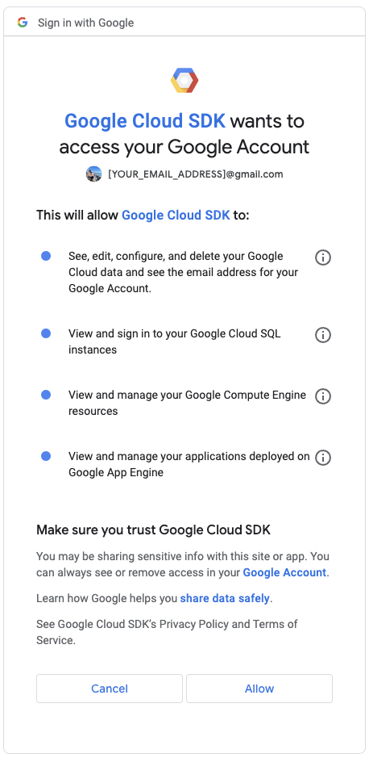

# Setting up for Node
We don't do this until later in the semester, when we start using Node-based tools.

## Node.js
Node is a Javascript runtime environment we will use to build news applications. This is where things get kinda dicey with my (lack of) Windows experience. Microsoft recommends using nvm-windows to install node, so let's go with that.

- Follow [these directions to install nvm-windows](https://docs.microsoft.com/en-us/windows/nodejs/setup-on-windows) **BUT READ THE NEXT STEPS FIRST**.
  - When they say Launch Powershell, you should use **Git Bash** instead.
  - When it gets to installing Node.js **DON'T DO `nvm install latest`**.
  - Instead, use this command: `nvm install v16.18.0`
- In Git Bash, use the command `node --version` to make sure it worked.
  - You should get a response that says you are using `v16.18.0`.
- Now lets update npm:

```bash
npm install -g npm
```

## ICJ template setup
There are some additional global npm tools that we need to install for our tour of NodeJS-based build tools. Do each of these, one line at a time.

```bash
npm install -g gulp
npm install -g degit
```

These are for the task manager [Gulp](https://gulpjs.com/) and a scaffolding tool [Degit](https://www.npmjs.com/package/degit).

## Google Drive authentication
1. Follow the instructions found in [this link](https://www.educative.io/answers/how-to-install-google-cloud-cli-on-windows) to download and install the `gcloud` CLI tool.
   Once the installation has finished, run the command `gcloud --version` in your terminal, and you should get some output similar to this:
```bash
% gcloud --version
Google Cloud SDK 428.0.0
bq 2.0.91
core 2023.04.25
gcloud-crc32c 1.0.0
gsutil 5.23
Updates are available for some Google Cloud CLI components.  To install them,
please run:
  $ gcloud components update
% 
```

2. We are now going to authenticate our Google credentials on our local machine, using the following command `gcloud auth login --brief --enable-gdrive-access`.
   This will open a browser where it will show you all of your available Google names.
   **Make sure to select your _personal_ gmail account for this part**. If you use your `utexas.edu` email, you won't have permission to do what we need to do.
   After you select your _personal_ gmail account, you will be sent to a permissions screen that will look something like this: \
    \
   Click `Allow` and you will have given your computer access to manage files on your Google Drive and in the Google Cloud Project.
```bash
% gcloud projects create --set-as-default --name="ICJ Project"
No project id provided.

Use [icj-project-390720] as project id (Y/n)?  y

Create in progress for [https://cloudresourcemanager.googleapis.com/v1/projects/icj-project-390720].
Waiting for [operations/VERY_LARGE_STRING] to finish...done.                                                                                                                            
Enabling service [cloudapis.googleapis.com] on project [icj-project-390720]...
Operation "operations/acat.p2-379330608294-a07db4fa-06c4-4da3-babc-7c44f5dd168d" finished successfully.
Updated property [core/project] to [icj-project-390720].
%
```

3. Enter the command `gcloud auth application-default login` into your terminal, follow the browser prompts, and you should be able to see what project you are logged into.
```bash
% gcloud auth application-default login
Your browser has been opened to visit:

    https://accounts.google.com/o/oauth2/auth?[VERY_LARGE_STRING]


Credentials saved to file: [%APPDATA%\gcloud\application_default_credentials.json]

These credentials will be used by any library that requests Application Default Credentials (ADC).

Quota project "[RECENTLY_CREATED_PROJECT_ID]" was added to ADC which can be used by Google client libraries for billing and quota. Note that some services may still bill the project owning the resource.
% 
```

4. Take the project ID, `icj-project-390720` in this example, and enter the following commands, and you should see similar outputs.

Creates a service account called `generic-service-account`.
```bash
% gcloud iam service-accounts create generic-service-account
Created service account [generic-service-account].
%
```

Binds the `generic-service-account` to the editor role for the specified project.
```bash
name@computercurrent-folder % gcloud projects add-iam-policy-binding [YOUR PROJECT ID] --member='serviceAccount:generic-service-account@[YOUR PROJECT ID].iam.gserviceaccount.com' --role='roles/editor'
Updated IAM policy for project [[YOUR PROJECT ID]].
bindings:
- members:
  - serviceAccount:generic-service-account@[YOUR PROJECT ID].iam.gserviceaccount.com
  role: roles/editor
- members:
  - user:emailAddress@gmail.com
  role: roles/owner
etag: BwX-xm7Obo4=
version: 1
%
```

Enables the Google Docs and Sheets API for your project.
```bash
% gcloud services enable docs.googleapis.com sheets.googleapis.com
Operation "operations/[VERY_LARGE_STRING]" finished successfully.
%
```

Create the service account authorization keys.
```bash
% gcloud iam service-accounts keys create "%APPDATA%\gcloud\service_account_key.json" \
    --iam-account=generic-service-account@[YOUR PROJECT ID].iam.gserviceaccount.com
created key [VERY_LARGE_STRING] of type [json] as [$HOME/.config/gcloud/service_account_key.json] for [generic-service-account@[YOUR PROJECT ID].iam.gserviceaccount.com]
%
```

Add the key to your `.bash_profile` through the command line.
```bash
% echo 'export GOOGLE_APPLICATION_CREDENTIALS="$APPDATA\gcloud\service_account_key.json"' >>~\.bash_profile
%
```

Sync your terminal with the current state of your `.bash_profile`.
```bash
% source ~\.bash_profile
%
```

We'll test this with the icj-project-template when the time comes. If you use OneDrive, you might have to use **Git Bash** for some steps instead of the terminal within VS Code.

### Setting up the environment variable for GitHub Codespaces
These environment variables will be used when you are accessing this project through [GitHub Codespaces](https://github.com/features/codespaces).
We will be following the process shown [here](https://docs.github.com/en/codespaces/managing-your-codespaces/managing-encrypted-secrets-for-your-codespaces#adding-a-secret).

**NOTE:** It is absolutely imperative that you DO NOT commit the contents of `service_account_key.json` to your branch at all. If someone else were able to see the contents of that file, they could execute any action that service account has in its abilities.
Since `service_account_key.json` is in the `.gitignore` file, you should not be able to check it in, but it is important to remember that for the sake of transparency.

Step-specific information for the first environment variable:<br>
4. The "Name" of the secret will be `GOOGLE_CREDENTIALS`.<br>
5. The "Value" of the secret will be the contents of the `$HOME/.config/gcloud/service_account_key.json` file.<br>
6. The repository that you will give access to it will be the name of the repository you are using in the Codespace, presumably `icj-project-rig`.

Step-specific information for the first environment variable:<br>
4. The "Name" of the secret will be `GOOGLE_APPLICATION_CREDENTIALS`.<br>
5. The "Value" of the secret will be `service_account_key.json`.<br>
6. The repository that you will give access to it will be the name of the repository you are using in the Codespace, presumably `icj-project-rig`.

When you open your Codespace, you will run the following command, and you should be able to get to work quickly:
```bash
$ npm run codespace-google-auth
```

## Possible test scenario
- Create a folder in your icj folder called `yourname-test`.
- Open that folder in Visual Studio Code.
- Open a VS Code Terminal and run:

```bash
$ degit utdata/icj-google-fetch-test#main
```

You should get this in return:

```bash
> cloned utdata/icj-google-fetch-test#main
```

And it will download a bunch of files into your folder.

- Run `npm ci`. This will also download a bunch of files. It might take a couple of minutes to run.
- Run `gulp fetch`.

If everything works, you should have a return like this:

```bash
$ gulp fetch
[14:38:53] Using gulpfile ~/Documents/icj/icj-fetch-test/gulpfile.js
[14:38:53] Starting 'fetch'...
[14:38:53] Finished 'fetch' after 8.61 ms
Downloaded `library` (1RgMhjtkXlbbf9uzSzy_xPRKwxcVZIZqVytgM_JoU4E4)
Downloaded `bookstores` (1gDwO-32cgpBDn_0niV0iu6TqQTaRDr4nmSqnT53magY)
```

Your path might differ for "Using gulpfile", but what you are looking for is **"Downloaded \`library\`"** and **"Downloaded \`bookstores\`**. If you didn't get BOTH of those then something isn't right.

If you get an error, try this before reaching out to me:

- Open Git Bash
- Use `cd` to get into your test folder. Make sure you are there using `pwd`.
- run `gulp fetch` to see if it downloads two files.

If that also doesn't work, reach out to me to troubleshoot.

----

You should be done!

> Note for Crit: Might be able to use `%userprofile%` instead of `C:/Users/your_username/`.
